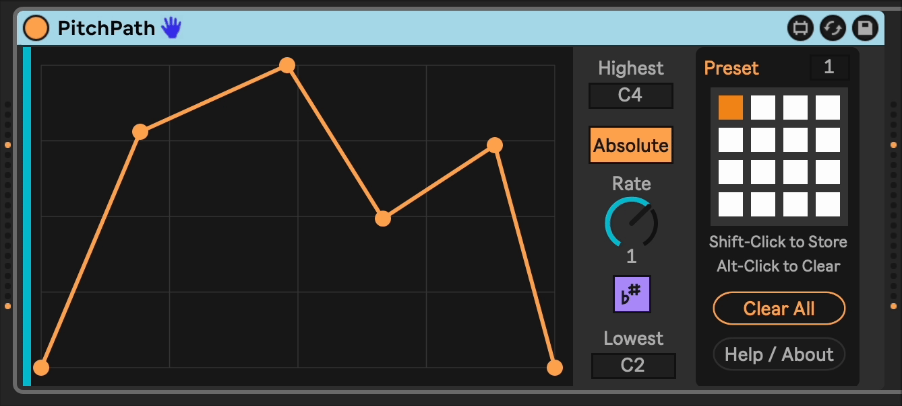

# PitchPath

PitchPath is a pitch sequencer that you program by drawing a line or curve.

You specify the time duration the line represents, as well as the lowest and highest notes (absolute or relative).

Note that PitchPath *only* deals in note pitch, and is completely decoupled from the rhythmic element of a musical phrase. This lets you treat pitch and timing independently. For instance, you could have a short looping clip of notes representing the rhythmic element of a melody. PitchPath receives each note, and depending on where it is in its own timing cycle (controlled by the `Rate` knob) will modify the pitch of the note it received before sending it out. PitchPath can be running at a different cycle length than the clip with notes, so you can get interesting variations or phasing effects between the two.

In `Absolute` mode, the pitch of those notes is completely disregarded, and the note value from the graph is used instead.

In `Relative` mode, the graph describes an offset to apply to the incoming note value before outputting it.

In both cases, the note that is output may be optionally aligned to the Global Scale in Live 12.

## Installation

[Download the newest .amxd file from the latest release](https://github.com/zsteinkamp/m4l-PitchPath/releaes) or clone this repository, and drag the `PitchPath.amxd` device into a track in Ableton Live.

## Changelog

* 2025-02-05 [v2](https://github.com/zsteinkamp/m4l-PitchPath/releases/download/v2/PitchPath-v2.amxd) - Allowed to run free when the transport is not running; Fixed a bug around relative pitch mode and incoming note pitch lag.
* 2025-01-12 [v1](https://github.com/zsteinkamp/m4l-PitchPath/releases/download/v1/PitchPath-v1.amxd) - Initial release.

## Usage

### Setup
* Use the `Highest` and `Lowest` textboxes to set your output note range.
* Choose `Absolute` or `Relative` pitch mode.
  * `Absolute` mode will ignore the pitch of the incoming note, and only output notes in the range you specify.
  * `Relative` mode will adjust the pitch of the incoming note within the constraints of the `Highest` and `Lowest` values.
* Select a time interval that the graph represents.
* Enable or disable `Scale Awareness`

### Usage
* Send notes to PitchPath with MIDI notes, an arpeggiator, or another device like [LenStepper](https://plugins.steinkamp.us/m4l-LenStepper).

## TODO

* Non-note time values (?)

## Contributing

I'd love it if others extended this device. If you would like to contribute, simply fork this repo, make your changes, and open a pull request and I'll have a look.
